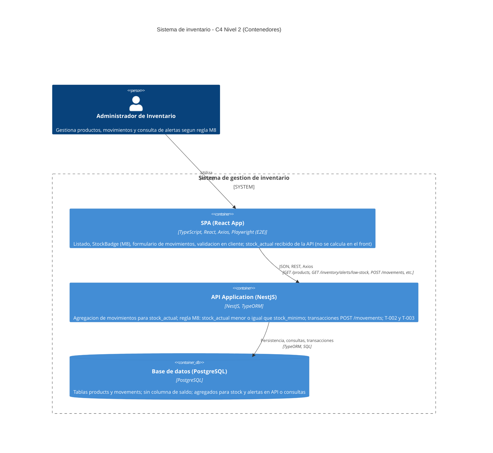
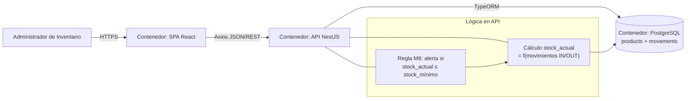

# C4 Nivel 2 — Diagrama de contenedores (Mermaid)

Muestra el **Administrador de Inventario**, el **SPA React** (Axios), la **aplicación API (NestJS)** y **PostgreSQL**. Se explicitan en el contenedor de backend el **cálculo lógico de `stock_actual`** a partir de movimientos y el **requisito M8** (`stock_actual <= stock_mínimo`, inclusivo) como reglas de negocio del sistema.

> Mermaid: sintaxis C4. Si el renderizador no soporta `C4Container`, usar una alternativa o [mermaid live editor](https://mermaid.live) con versión reciente.

## Requisitos visibles en el contenedor API (y datos)

Añade en documentación o en el mismo gráfico (anotaciones) los siguientes puntos, que el diagrama C4 de arriba condensa en el propósito de **NestJS** y **PostgreSQL**:

| Requisito | Descripción en arquitectura |
| ---------- | --------------------------- |
| **Cálculo de `stock_actual`** | **Operación lógica** en la capa de aplicación o en consulta SQL/TypeORM: agregar `Movement` por producto (entradas − salidas). **No** se persiste como columna de saldo en `Product` ([PRD 3.3](../PRD.md#33-consulta-de-stock-actual), [data-model](./data-model.md)). |
| **Regla M8 (alerta)** | **Requisito de sistema** evaluado al servir `GET /products` (p. ej. DTO con `stock_actual`) y `GET /inventory/alerts/low-stock`: filtro/flag cuando `stock_actual <= stock_mínimo` (inclusivo). El **SPA** refuerza con **StockBadge** rojo en la lista. |

Flujo de datos resumido (espacialmente entre contenedores):

1. **Administrador** → **SPA** → **API** → **PostgreSQL** (lectura/escritura de `products` y `movements` solo como eventos; saldo = agregado).
2. **Alertas y listado enriquecido** responden desde **API** aplicando cálculo + comparación M8; **React** solo consume y pinta (incl. validación en tiempo real de formularios, no sustituto de validación en servidor).

## Diagrama alternativo (C4-PlantUML estilo en Mermaid: flujo con notas)

Si el renderizador no muestra C4, este diagrama de flujo en Mermaid mantiene los mismos actores y **deja explícito** cálculo y M8:

- **Cálculo** y **M8** son responsabilidad del contenedor **API** (lógica y consultas), con datos de **movimientos** en **PostgreSQL**; el **SPA** recibe DTOs ya enriquecidos o endpoints dedicados a alertas.
