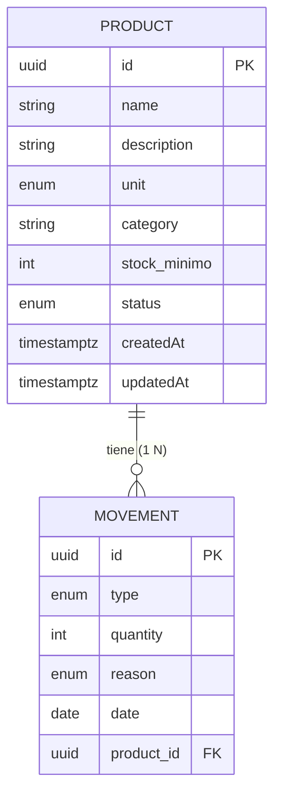

# Diagrama entidad–relación (Mermaid)

Modelo lógico alineado a [data-model.md](./data-model.md). **`stock_actual` no es atributo almacenado**; se deriva de movimientos (entradas − salidas). La relación 1:N entre productos y movimientos soporta la integridad y el borrado condicionado (T-002).

## Nota sobre `stock_actual` y M8

- **Stock actual:** atributo **calculado** a partir de `MOVEMENT` (suma `IN` − suma `OUT` por `product_id`). No aparece en `PRODUCT` en el esquema persistente.
- **Regla M8 (alerta):** condición lógica `stock_actual <= stock_minimo` evaluada en consulta (p. ej. `GET /products` enriquecido, `GET /inventory/alerts/low-stock`), no como columna de alerta en esta ER.

## Integridad (T-002)

- `MOVEMENT.product_id` referencia `PRODUCT.id` (NOT NULL).
- Política de borrado recomendada: **RESTRICT** / no permitir eliminar `PRODUCT` mientras existan filas en `MOVEMENT` con ese `product_id` (véase [data-model.md](./data-model.md)).
